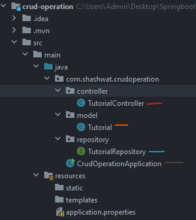
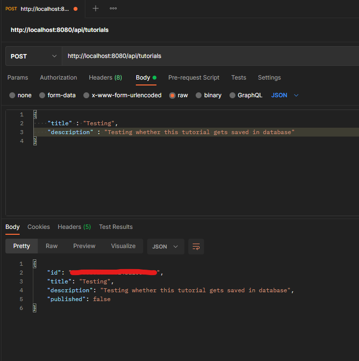
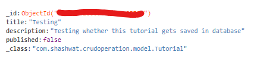
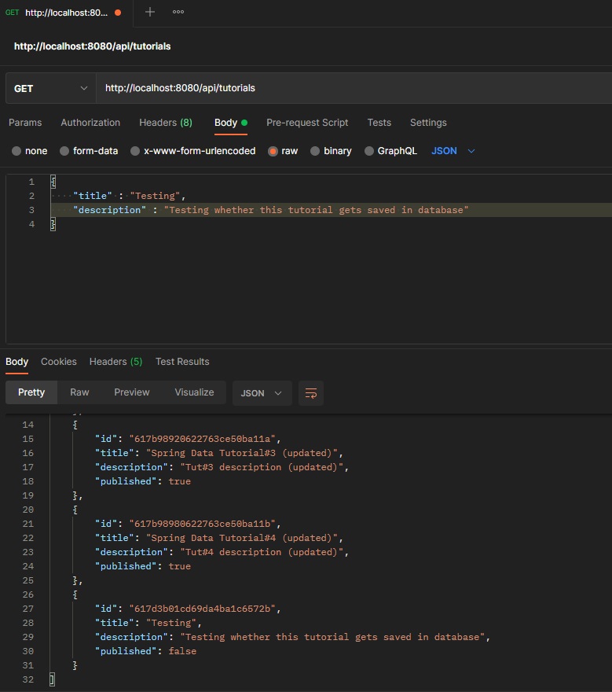
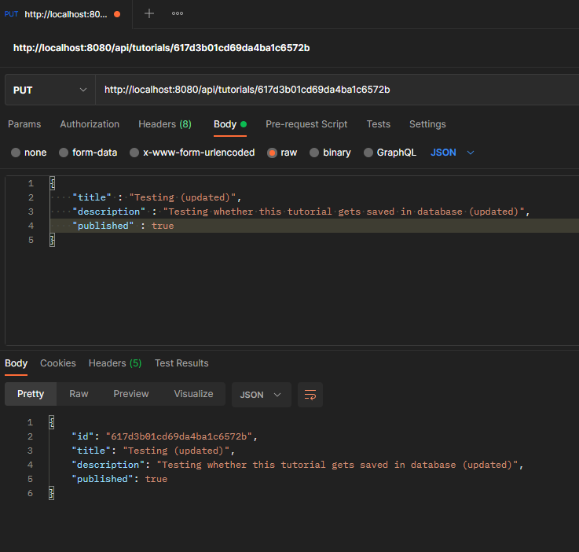
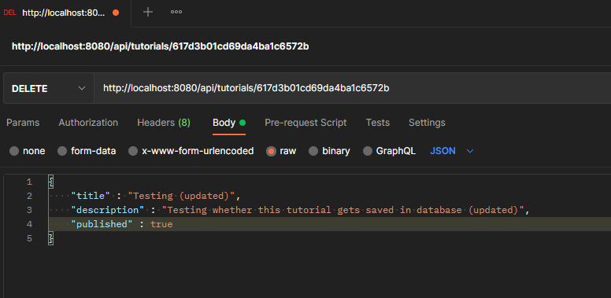
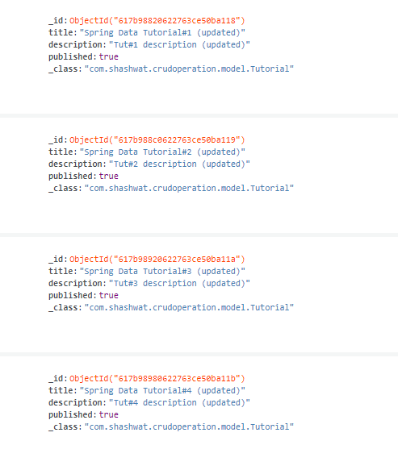

# CRUD-SpringBoot-MongoDB
Heyy Coders!!! My name is Shashwat Sharma and in this repository we will learn how to do CRUD Operation in Spring-boot framework. <br>
C - Create <br>
R - Read <br>
U - Update <br>
D - Delete <br>

## How to Connect MongoDB Atlas with Spring-boot Framework
I have explained in detail in this [repository](https://github.com/shashwat2910/MongoDB-SpringBoot) <br>
Just follow those steps

## If you are done connecting with it then just let's begin 

## Overview Of the API we are coding

|Methods   	|Urls   	|Actions   	|
|---	|---	|---	|
|POST   	|   /api/tutorials  	| create new Tutorial  	|
| GET  	| 	/api/tutorials  	|  	retrieve all Tutorials 	|
|   GET	|  /api/tutorials/:id 	| 	retrieve a Tutorial by :id	  	|
|   PUT	| /api/tutorials/:id  	| 	update a Tutorial by :id 	 	|
|   DELETE	|  	/api/tutorials/:id 	|  	delete a Tutorial by :id 	|
|  DELETE 	|   /api/tutorials	|  	delete all Tutorials 	|
|  GET 	|  /api/tutorials/published 	|  	find all published Tutorials 	|   
<br>

## Your directory

<br>
The one with red dash file is where your whole logic of api code goes there.
<br>
The one with orange dash file is your model. It contains the detail you want to provide.
<br>
The one with blue dash file is your interface file. It extends the mongo repository model. 
<br>
The one with brown file JUST IGNORE it !!
<br>


# Tutorial.java the Model file

```
    @Id
    private String id;
    private String title;
    private String description;
    private boolean published;
```
- id: it contains individual object ID of every tutorial we make
- title : it contains the title of the tutorial
- description : it contains description of the tutorial
- published: it is a boolean value true or false. Whether the tutorial has been published yet or not
<br>

## Get and Set Method
```
public Tutorial(String title, String description, boolean published) {
        this.title = title;
        this.description = description;
        this.published = published;
    }
    public String getId() {
        return id;
    }

    public String getTitle() {
        return title;
    }

    public void setTitle(String title) {
        this.title = title;
    }

    public String getDescription() {
        return description;
    }

    public void setDescription(String description) {
        this.description = description;
    }

    public boolean isPublished() {
        return published;
    }

    public void setPublished(boolean isPublished) {
        this.published = isPublished;
    }

    @Override
    public String toString() {
        return "Tutorial [id=" + id + ", title=" + title + ", desc=" + description + ", published=" + published + "]";
    }
```
We are set for the model

# TutorialRepository.java interface
```
public interface TutorialRepository extends MongoRepository<ModelName, String>
```
Our Model is Tutorial
```
public interface TutorialRepository extends MongoRepository<Tutorial, String> {
//    GET Method to find tutorial with field published as true
    List<Tutorial> findByPublished(boolean published); 
//    GET Method to find tutorial with title
    List<Tutorial> findByTitleContaining(String title);
}
```
# TutorialController.java
This is where our main logic comes here

## GET Method to get all tutorials in database
```
@GetMapping("/tutorials")
    public ResponseEntity<List<Tutorial>> getAllTutorials(@RequestParam(required = false) String title) {
        try {
            List<Tutorial> tutorials = new ArrayList<Tutorial>();
            if (title == null)
                tutorials.addAll(tutorialRepository.findAll());
            else
                tutorials.addAll(tutorialRepository.findByTitleContaining(title));

            if (tutorials.isEmpty()) {
                return new ResponseEntity<>(HttpStatus.NO_CONTENT);
            }
            return new ResponseEntity<>(tutorials, HttpStatus.OK);

        } catch (Exception e) {
            return new ResponseEntity<>(null, HttpStatus.INTERNAL_SERVER_ERROR);
        }
    }
```

## GET Method to get Tutorial by the id
```
 @GetMapping("/tutorials/{id}")
    public ResponseEntity<Tutorial> getTutorialById(@PathVariable("id") String id) {
        Optional<Tutorial> tutorialData = tutorialRepository.findById(id);
        if (tutorialData.isEmpty()) {
            return new ResponseEntity<>(HttpStatus.NOT_FOUND);
        } else {
            return new ResponseEntity<>(tutorialData.get(),HttpStatus.OK);
        }
    }
```

## GET Method to get Tutorial whose published field is true
```
@GetMapping("/tutorials/published")
    public ResponseEntity<List<Tutorial>> findByPublished() {
        try {
            List<Tutorial> tutorials = tutorialRepository.findByPublished(true);

            if (tutorials.isEmpty()) {
                return new ResponseEntity<>(HttpStatus.NO_CONTENT);
            }
            return new ResponseEntity<>(tutorials, HttpStatus.OK);
        } catch (Exception e) {
            return new ResponseEntity<>(HttpStatus.INTERNAL_SERVER_ERROR);
        }
    }
```

## POST Method to add a new tutorial
```
@PostMapping("/tutorials")
    public ResponseEntity<Tutorial> createTutorial(@RequestBody Tutorial tutorial) {
        try {
            Tutorial _tutorial = tutorialRepository.save(new Tutorial(tutorial.getTitle(), tutorial.getDescription(), false));
            return new ResponseEntity<>(_tutorial, HttpStatus.CREATED);
        } catch (Exception e) {
            return new ResponseEntity<>(null, HttpStatus.INTERNAL_SERVER_ERROR);
        }
    }
```

## PUT Method to update any field of existing tutorial
```
@PutMapping("/tutorials/{id}")
    public ResponseEntity<Tutorial> updateTutorial(@PathVariable("id") String id, @RequestBody Tutorial tutorial) {
        Optional<Tutorial> tutorialData = tutorialRepository.findById(id);
        if (tutorialData.isPresent()) {
            Tutorial _tutorial = tutorialData.get();
            _tutorial.setTitle(tutorial.getTitle());
            _tutorial.setDescription(tutorial.getDescription());
            _tutorial.setPublished(tutorial.isPublished());
            return new ResponseEntity<>(tutorialRepository.save(_tutorial), HttpStatus.OK);
        } else {
            return new ResponseEntity<>(HttpStatus.NOT_FOUND);
        }
    }
```

## DELETE Method to delete a tutorial by an id
```
@DeleteMapping("/tutorials/{id}")
    public ResponseEntity<HttpStatus> deleteTutorial(@PathVariable("id") String id) {
        try {
            tutorialRepository.deleteById(id);
            return new ResponseEntity<>(HttpStatus.NO_CONTENT);
        } catch (Exception e) {
            return new ResponseEntity<>(HttpStatus.INTERNAL_SERVER_ERROR);
        }
    }
```

## DELETE Method to delete all tutorials
```
 @DeleteMapping("/tutorials")
    public ResponseEntity<HttpStatus> deleteAllTutorials() {
        try {
            tutorialRepository.deleteAll();
            return new ResponseEntity<>(HttpStatus.NO_CONTENT);
        } catch (Exception e) {
            return new ResponseEntity<>(HttpStatus.INTERNAL_SERVER_ERROR);
        }
    }
 ```
 # Testing !!!
 
 ## Adding a new Tutorial
 
 ## Checking on database 
 
 ## GET Method to fetch all tutorials in databases
 
 ## PUT Method to edit the particular tutorial
 
 ## DELETE the tutorial
 
 ## Database 
 
 
 
 If you have any doubts or errors please feel free to connect me on [Linkedin](https://www.linkedin.com/in/shashwat-sharma-79221218a/) [shashwat2910@gmail.com](mailto:shashwat2910@gmail.com)


